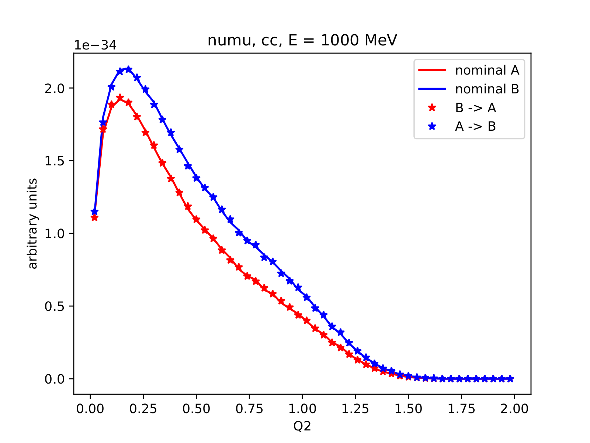

% Reweighting in NuWro
% Tomasz Golan
% OPUS meeting, 17-18.05.2018

# What is NuWro?


# What is an event generator?

```
+----------+   +----------+   +----------+   +----------+
|          |   |          |   |          |   |          |
|   Beam   | + |  Target  | + |  Models  | + |  Params  |
|          |   |          |   |          |   |          |
+----------+   +----------+   +----------+   +----------+

                            +   
                            |   
                            |   
                            |   
                          \ | /
                           \ /
                           
                      +------------+
                      |            |
                      |   Events   |
                      |            |
                      +------------+
```

# What is an event?

```
                  +--------------+
                  |              |
        +---------+    Event     +---------+
        |         |              |         |
        |         +--------------+         |
        |                                  |
        v                                  v
+--------------+                    +--------------+
|              |                    |              |
|  Kinematics  |                    |    Weight    |
|              |                    |              |
+--------------+                    +--------------+
 - initial lepton     \
 - target nucleon      |
 - final lepton        |-> + params = cross section
 - knocked out nucleon |
 - other hadrons      /
```

# What is reweighting?

> Reweighting is a procedure to calculate a new weight for an existing event with new model parameters.

```
+--------------+                +--------------+
|              |      new       |              |
|    Event     |  +---------->  |    Event'    |
|              |     params     |              |
+--------------+                +--------------+

 - kinematics                    - kinematics
 - weight                        - new weight
```

# Why would one need reweighting?

```
+-------------+      +-------------+      +-------------+
|             |      |             |      |             |
|    Beam     |      |  Neutrino   |      |  Detector   |
|             | ---> |             | ---> |             |
| Simulation  |      | Interaction |      | Simulation  |
|             |      |             |      |             |
+-------------+      +-------------+      +-------------+
 not affected         new params           computationally
 by params            new events           expensive
```

# How does it work?

```
+-------------+      +-------------+      +-------------+
|             |      |             |      |             |
|  Neutrino   | ---> |  Detector   | ---> |   Events    |
|             |      |             |      |             |
+-------------+      +-------------+      +-------------+
                                                |   
                                             ---|---
                                                |
+-------------+      +-------------+      +-------------+
|             |      |             |      |             |
|"new" events | <--- | Reweighting | <--- | new params  |
|             |      |             |      |             |
+-------------+      +-------------+      +-------------+
```                                  

# What knobs so far in NuWro

* For quasi-elastic scattering

    * `qel_cc_axial_mass`

    * `qel_nc_axial_mass`
    
    * `qel_s_axial_mass`
    
    * `delta_s`

* For pion production

    * `pion_axial_mass`

    * `pion_C5A`

# QEL reweighting



# RES reweighting


# RES reweighting


# Next step - FSI reweighting

\begin{center}
\includegraphics[width=0.75\columnwidth]{img/fsi.pdf}
\end{center}

# Intranuclear cascade

* many (re)interactions

* the reweighting procecedure should NOT affect lepton

* start with two parameters:

    * `kaskada_NN_mfp_scale`

    * `kaskada_piN_mfp_scale`

* **work in progress**

# Current approach
    
* The survival probability: $P_{surv} = e^{-\lambda/\tilde\lambda}$

* The mean free path: $\tilde\lambda = \left[\sigma_p\rho_p + \sigma_n\rho_n\right]^{-1}$

* The free path: $\lambda = -\tilde\lambda\cdot\ln(P_{surv})$, where $P_{surv} = \text{rand}[0,1]$

    * If $\lambda < 0.2$ fm: interaction happened, step length = $\lambda$

    * If $\lambda > 0.2$ fm: no interaction, step length = $0.2$ fm

* The step probability:
$$
P_{step} = 
\begin{cases}
e^{-0.2/\tilde\lambda} & \text{no interaction} \\
1 - e^{-\lambda/\tilde\lambda} & \text{interaction}   
\end{cases}
$$

# Current approach

* The event probability: $$P_{event} = \prod\limits_{steps}P_{step}$$

* FSI parameters affects mean free path: $\tilde\lambda \rightarrow \tilde\lambda'$

* The new weight for an event is calculated using: $$w = N\frac{P'_{event}}{P_{event}}$$

* Where $N$ is normalization factor, so total cross section is the same after reweighting

# First test

* As mentioned, it is work in progress

* First test

    * beam: $\nu_\mu$, $E_\nu = 1$ GeV

    * target: Carbon

    * channels: QEL CC, QEL NC

    * reweighted parameter: mean free path scaling (nucleons)

    * observables: number of reinteractions, lepton and nucleon kinetic energy

#


#


#


# Summary

* QEL and RES reweighting is done

* FSI reweighting - work in progress

* First FSI REW results looks promising
